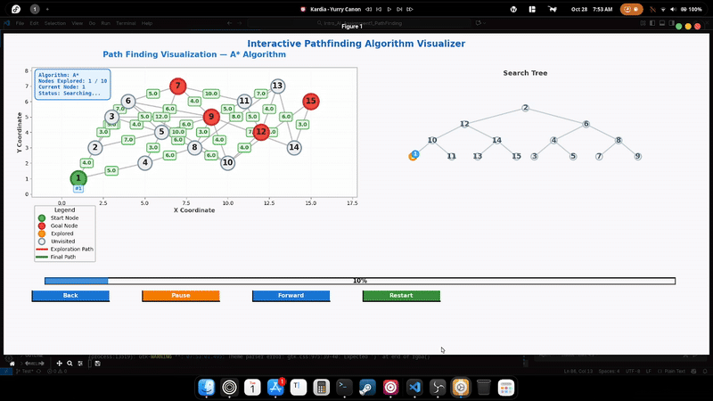

# 🧭 Intro to AI — Assignment 2a · Path Finding

This repository contains a **Python path-finding system** with **interactive visualizations**, developed for an AI assignment.  
It demonstrates several classic and custom search algorithms operating on a 2D weighted graph with a **Binary Search Tree (BST)** showing exploration order — all visualized side-by-side.

---

## 📂 Contents

| File | Description |
|-------|--------------|
| `search.py` | Main program implementing all search algorithms, visualization logic, and interactive UI |
| `bst_visualizer.py` | Handles Binary Search Tree layout and rendering (Reingold–Tilford algorithm) |
| `search_utils.py` | Utility functions for parsing, heuristics, and supporting logic *(if separated)* |
| `test_cases/` | Example problem files for testing |
| `UI_GUIDE.md` | Guide explaining the interactive controls and visualization interface |

---

## 🔍 Implemented Algorithms

| Type | Method | Description |
|-------|--------|-------------|
| **Uninformed** | `DFS` | Depth-First Search – explores deeply before backtracking |
|  | `BFS` | Breadth-First Search – explores all neighbors level by level |
| **Informed** | `GBFS` | Greedy Best-First Search – selects node with smallest heuristic value |
|  | `A*` | A-Star Search – balances cost (g) and heuristic (h) for optimal paths |
| **Custom (Hybrid)** | `CUS1` | **Uniform Cost Search + Heuristic Tie-Break** — expands lowest g(n); uses h(n) to resolve ties |
| **Custom (Heuristic-Weighted)** | `CUS2` | **Weighted A\*** (f = g + 1.5·h) — trades optimality for speed |

All algorithms share the same visualization engine and BST construction logic.

---

## 🧮 Heuristic Function

Euclidean distance between nodes is used for informed methods:

```python
heuristic(a, b) = sqrt((x_a - x_b)**2 + (y_a - y_b)**2)
```

---

## 🗂 Problem File Format

Plain-text files divided into four sections:

```
Nodes:
1: (x,y)
2: (x,y)
...

Edges:
(1,2): cost
(2,3): cost
...

Origin:
1

Destinations:
5, 9, 12
```

Notes:
- Each edge is directional.  
- Coordinates are used both for the heuristic and graph layout.  
- Multiple destinations can be listed separated by commas or semicolons (`5, 9, 12` or `5; 9; 12`).  
- Empty lines and comments (`# …`) are safely ignored.

---

## 🖥 Usage

Run from terminal:

```bash
python search.py <problem_file> <method>
```

Example:
```bash
python search.py ./test_cases/PathFinder-test.txt A*
```

Available methods (case-insensitive):

```
DFS, BFS, GBFS, A*, AS, CUS1, CUS2
```

---

## 🧠 Output Example

```
PathFinder-test.txt A*
Goal found: 5
Nodes visited: 10
Path: 2 → 3 → 5
```

After the textual output, an **interactive Matplotlib window** will open showing the search process.

---

## 🎮 Interactive Visualization Features

### 🧩 Layout Overview

| Area | Description |
|-------|-------------|
| **Left Panel** | Graph view – nodes, edges, costs, and live exploration |
| **Right Panel** | Binary Search Tree – visualizes exploration order |
| **Top Bar** | Algorithm info box (name, nodes visited, current status) |
| **Bottom Bar** | Playback controls + progress bar (0–100%) |

### 🎨 Visual Elements

| Color | Meaning |
|--------|----------|
| 🟩 Green | Start node |
| 🔴 Red | Goal nodes |
| 🟧 Orange | Explored nodes |
| ⚫ Gray | Unvisited nodes |
| 🔺 Red lines | Exploration path |
| 🟢 Green lines | Final solution path |

### ▶ Playback Controls

- ⏮ **Back** – step backward frame-by-frame  
- ⏸ **Pause/Resume** – toggle playback  
- ⏭ **Forward** – step forward frame-by-frame  
- 🔁 **Restart** – replay full animation  

Each step shows node visit order, progress percentage, and dynamically updates both graph and BST views.

---

## 🧭 Multi-Goal Visualization (New Feature)

When a problem file contains multiple goals, the program now supports:

### 🧾 Goal Selection Menu
After computing all paths, the terminal displays:
```
Available goal nodes:
 1. Goal 10 | Path length = 5
 2. Goal 13 | Path length = 6
 3. Goal 15 | Path length = 7
```

You can:
- Enter the goal number to visualize its path,  
- or type `q` to quit.

### 🔁 Choose Another Path
After you close the visualization window, you’ll automatically return to the menu:

```
✔ Visualization closed.
Enter another goal to visualize (1–3) or 'q' to quit:
```

---

## 🧪 Example Test Files

You can create your own graphs using the same format following the exanmples ubder test_cases folder.

---

## 🖼 Showcase Gallery

### 📸 Visualization Examples
> *(Place your screenshots here — e.g. side-by-side Graph + BST views)*  
> Example placeholders below:




---

## ⚙ Requirements

- **Python 3.8+** (tested on 3.12)
- **Dependencies:** `matplotlib`, `networkx`, `numpy`

Install via:

```bash
python -m pip install -r requirements.txt
```

---

## 💡 Technical Highlights

- Dual synchronized visualization (graph + BST)  
- Automatic and manual playback controls  
- Reingold–Tilford BST layout for clean node placement  
- Dynamic progress bar + percentage tracker  
- Multi-goal exploration and selection menu  
- Custom hybrid algorithms (CUS1 & CUS2) for experimentation  

---

## 🧩 Future Ideas *(Optional Section for You)*
- Add graphical buttons for goal selection (Tkinter / Matplotlib UI)  
- Extend heuristics to multi-goal averaging  
- Export animation frames as MP4/GIF  

---